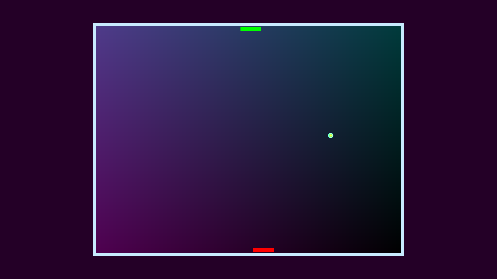
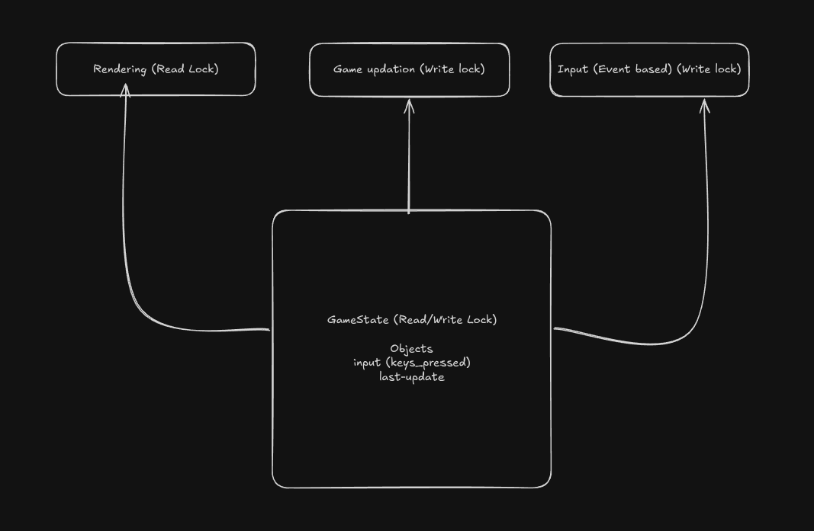

# nPong

My first big project in Rust. Trying to maximize learning through this. (Features minimal use of AI and maximal dying inside)

## Features (Currently)

- Game initialization
- Paddle movement
- Ball rendering and collisions
- Multithreaded game updates (rendering and updates handled separately)
- Both paddle work at the same time
- Acceleration for the paddle
- Game updates use Delta time
- Ball wall collisions reset game
- Randomizing ball starting state
- Real-time multiplayer

## Architecture (Will update with more)

### Features (Multiplayer)

- Real-time multiplayer support
- WebSocket-based networking
- Multiplayer room/lobby management
- Server-authoritative game state synchronization

## Up next

- Ball bouncing randomizing
- Sound effects
- Frame updates optimization (caching mechanism)
- Custom png rendering pipeline
- Intensive testing

## Reading Materials

- Rust auto generated documentation
- [Pixels GitHub Page](https://github.com/parasyte/pixels)

### Bugs (potentially)

- Paddle movement should also cause ball collision triggers
